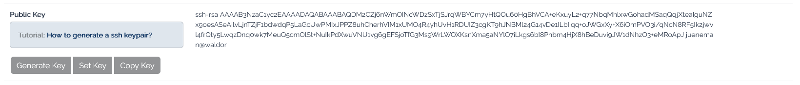
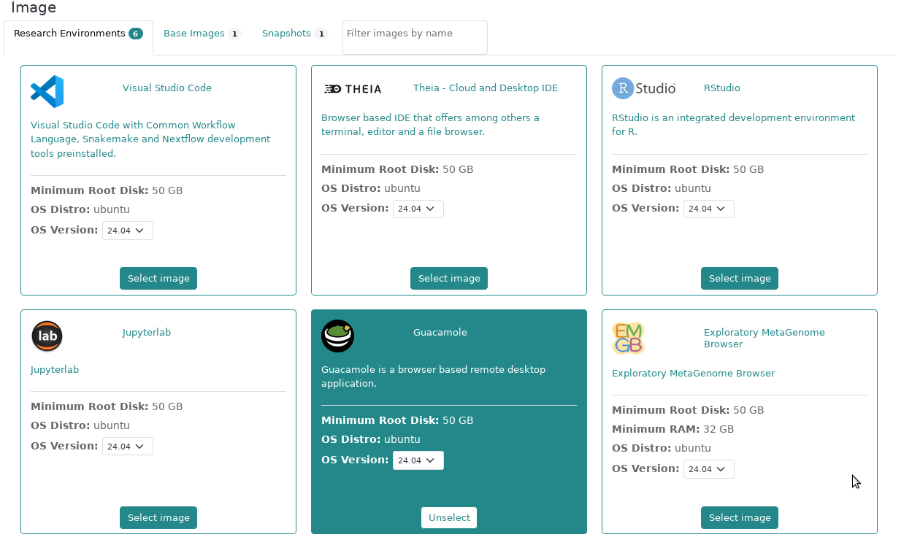
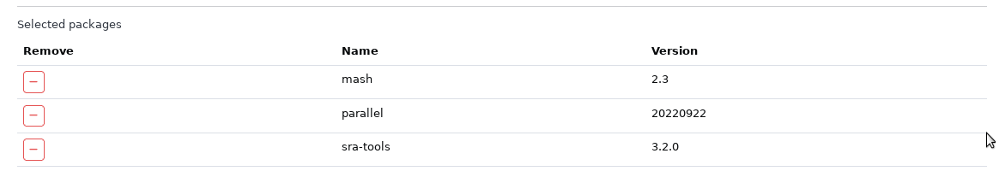
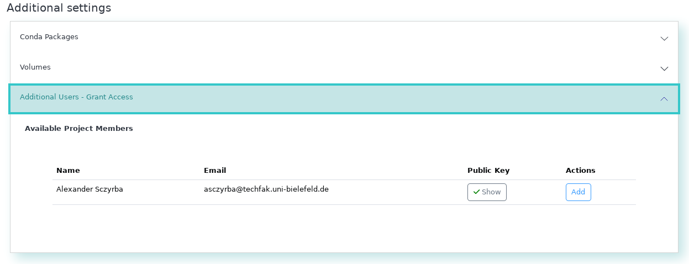
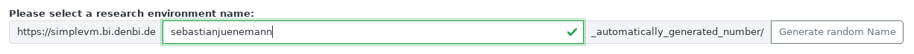

# Part 1: First Contact with the de.NBI Cloud

We will start slowly and get our very first virtual machine instance
running in the cloud.

The starting point for this tutorial is the de.NBI Cloud profile page
(<https://cloud.denbi.de/portal/>).

## 1.1 Create a de.NBI Cloud Account

If you do not have a de.NBI Cloud account, please register for one via
this link: <https://cloud.denbi.de/register>. You can read more about
the registration process in our de.NBI Cloud wiki:
<https://cloud.denbi.de/wiki/registration/>. Please make sure to
click on "continue" if this button shows up.

If you successfully registered for a de.NBI Cloud account, you should be
able to log in to the de.NBI Cloud Portal:
<https://cloud.denbi.de/portal/>.

## 1.2 Set an SSH key in your account

1.  Click on the `Profile` tab on the left and scroll down .

2.  If you have no SSH key set so far, just click on generate key and
    save the private key. During this workshop you will not need this
    file because you will access all VMs via the browser. However, for
    your future work using SimpleVM, we highly recommend to read the
    de.NBI Cloud wiki regarding SSH keys:
    <https://cloud.denbi.de/wiki/portal/user_information/#ssh-key>

2.(optional) If you have already a personal ssh key-pair, you can also
upload your *public* key here instead of generating one.

## 1.3 Join the *ib2025workshop1* Project

If you have not done yet, please click on the following link to request
access to the project:

[ib2025workshop
invitation](https://simplevm.denbi.de/portal/webapp/#/workshops/invitation/faecbc35ec5648e890f6510f583e2b38)

## 1.4 About the Tools and Prerequisites

In this workshop, we will use several tools that will be pre-installed in your VM through conda environments:

- **mash**: A fast genome and metagenome distance estimation tool
- **parallel**: GNU parallel for running jobs in parallel
- **fasterq-dump**: Part of the SRA Toolkit for converting SRA data

These tools will be available after activating the conda environment with `conda activate denbi` (covered later in this workshop).

**Note**: This workshop uses SimpleVM, which is a simplified interface for the de.NBI Cloud. The full OpenStack Horizon interface more advanced features but is not required for this workshop.

## 1.5 Select the *ib2025workshop1* project

You start this tutorial from your profile page (https://simplevm.denbi.de).

1. Click on the `New Instance` tab.

2. If you are already member of a SimpleVM project then you are offered a drop down menu to select
a project. In this case please select the **ib2025workshop1** project. If this is
your first SimpleVM project, you are now able to select/generate a key (next point) or directly start a VM.

3. If you have no SSH key set so far, just click on generate key and save the
private key. During this workshop you will not need this file because 
you will access all VMs via the browser. However, for your future work using
SimpleVM, we highly recommend to read our de.NBI Cloud wiki regarding
SSH keys: https://cloud.denbi.de/wiki/portal/user_information/#ssh-key

## 1.6 Start a VM

1. Choose a name for your VM.
2. Select **de.NBI small**.
3. In the image section, please click on the *Research Environments* tab 
   and select the **Guacamole** image based on **Ubuntu 24.04**.
   
4. Select the Conda tab and choose the following tools with their version numbers given below for installation via Conda:
   * parallel (20220922)
   * sra-tools (3.1.1)
   * mash (2.2)   
   
   
   You will learn in the next sections how to apply these tools.

5. Grant access to the workshop organizers (**Sebastian Jünemann** and **Abhijeet Shah**).
   This way these members get ssh access to your VM and can help you in case
   something does not work as expected.
   

6. Optional: Modify the URL path for Guacamole. You will access this VM via this URL.
   
7. Confirm the checkboxes and click on Start.

Next to [Section 2](Part2.md)

