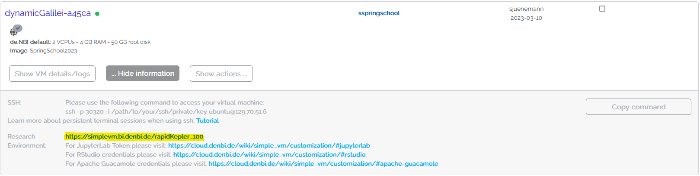
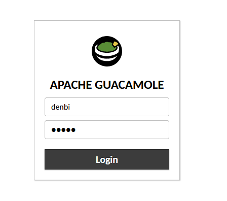
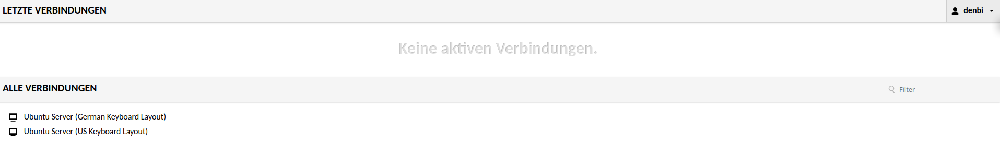
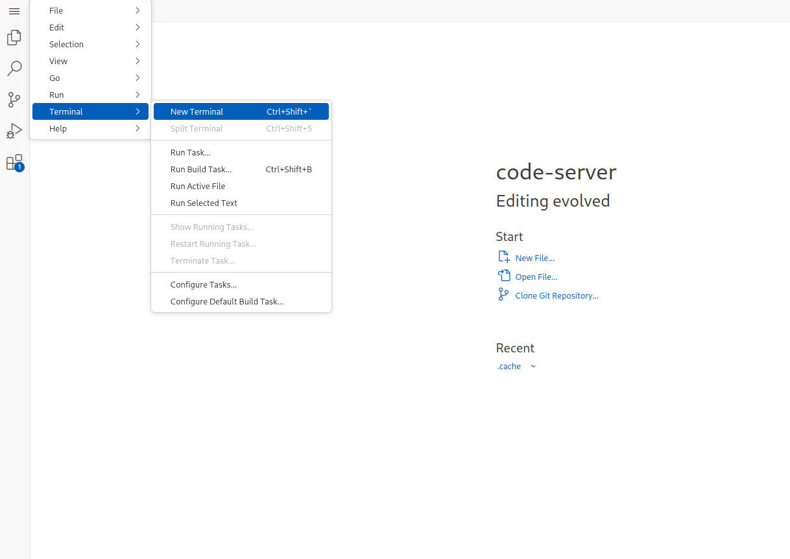

# Section 2: Verify your VM properties

After the start of the machine has been triggered, some time may pass
before the machine is available. As soon as this is the case, this
becomes visible via a green icon.

## 2.1 Login to your VM

1.  Click on the Instances tab (`Overview` -\> `Instances`). After you
    have initiated the start-up of the machine, you should have been
    automatically redirected there. Now open the "How to connect"
    dropdown of your machine. Click on the Theia IDE URL which opens a
    new browser tab.  A LifeScience
    login prompt appears if you haven't already logged in with your
    LifeScience account.

2.  Apache Guacamole is a clientless remote desktop gateway. It supports
    standard protocols like VNC, RDP, and SSH. We call it clientless
    because no plugins or client software are required. Thanks to HTML5,
    once Guacamole is installed on a server, all you need to access your
    desktops is a web browser.

Afterward a prompt to log in to Apache Guacamole shows.
 Use:

```         
username: denbi
password: denbi
```

as your login credentials.

After logging in, choose a keyboard layout.



**Note:** It may happen that, because of inactivity, a prompt for the
password of ubuntu user shows:

```         
username: denbi
password: denbi
```

## 2.2 Check your VM

Now we will use some basic linux commands to verify that SimpleVM
provisioned the VM correctly.

1.  Click on `Terminal Emulator` in the lower (second to left).
    

2.  Inspect the VM before starting to work with it. Let's check whether
    the VM has the properties that SimpleVM promised you by typing the
    following commands in your newly opened terminal window. `nproc`
    tells you the number of processing units.

``` bash
nproc
```

Does that correspond to the actual number of cores of the flavor you
selected? `free -h` tells you the amount of RAM that is available to
your VM. You will see that the sum of the total amount of Mem (first
column, second row) corresponds roughly to the RAM size of your selected
flavor.

``` bash
free -h
```

You can also check what kind of processes are running on your VM by
executing `top` or `htop`.

``` bash
htop
```

Exit `htop` by typing `q` or `F10`. Back to [Section 1](Part1.md) \|
Next to [Section 3](Part3.md)
