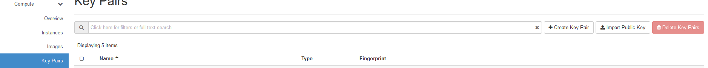
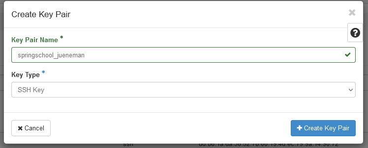
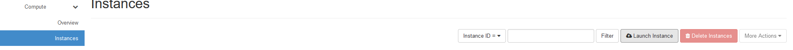
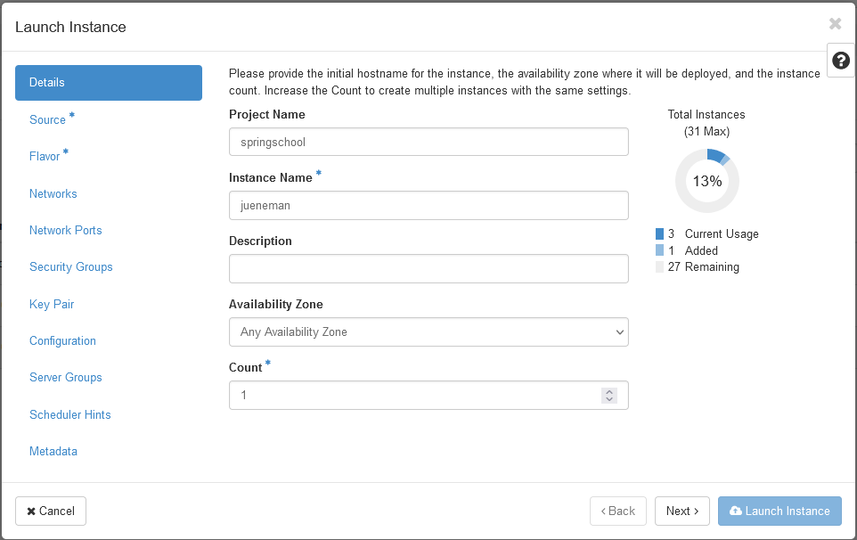
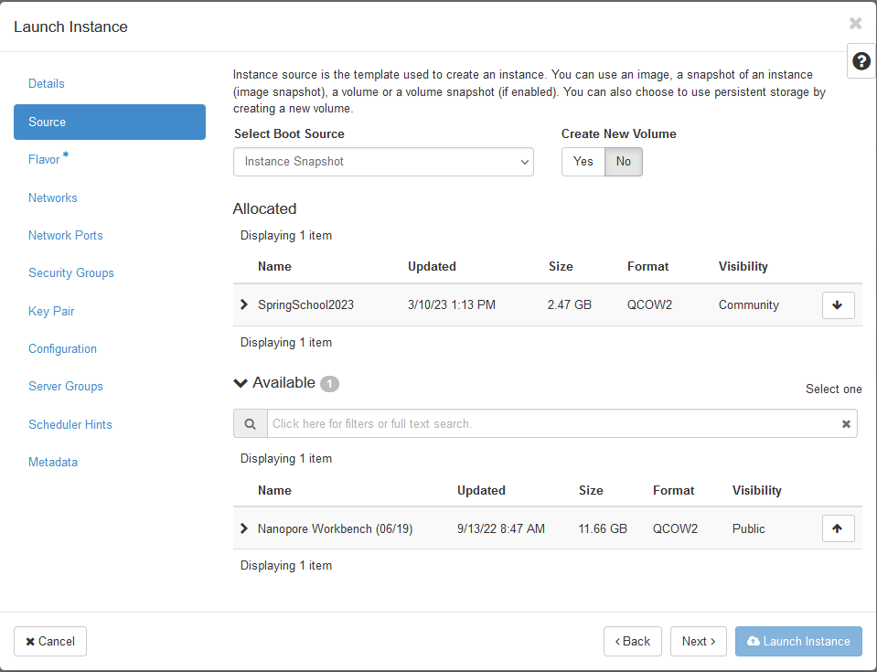
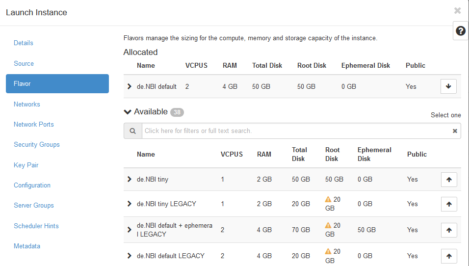
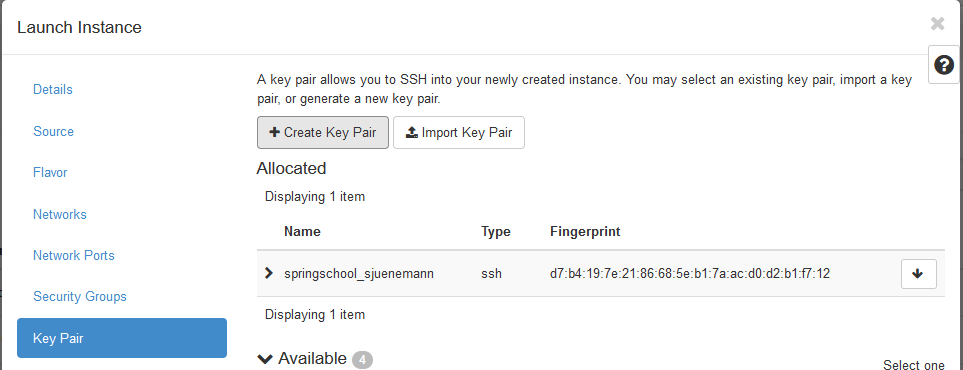
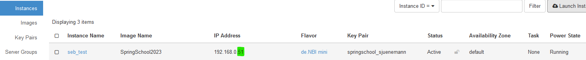
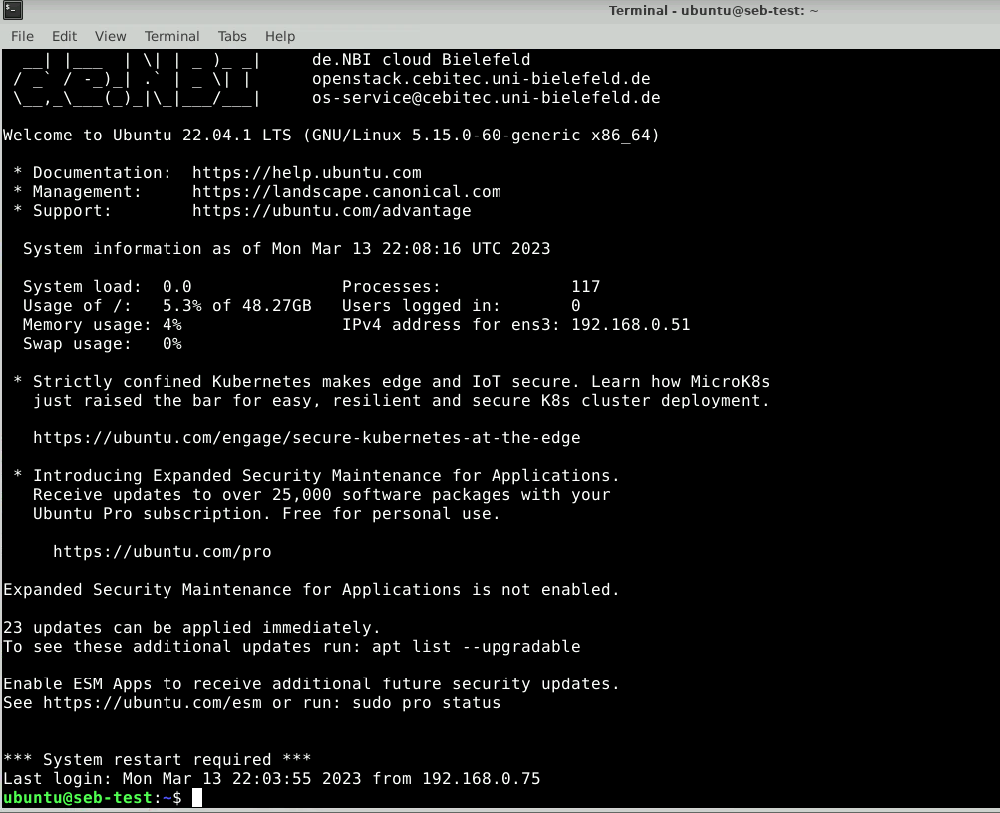

# Section 4: Using Horizon OpenStack Interface

We will now use your newly created SimpleVM as a replacement of any
given local compute infrastructure you might be working on in your
institute (or just for your laptop). Our goal is to transfer data from
your site (that is actually the SimpleVM) to your project in the de.NBI
Cloud. For that, we also initialize a second instance in the cloud using
the openstack interface.

## 4.1 Opening Horizon

1.  Go to [de.NBI Horizon (at
    Bielefeld)](https://openstack.cebitec.uni-bielefeld.de/project/)

## 4.2 Create a new Key Pair

2.  Click on the `Key Pairs` entry under the `Compute` menu and select
    `Create Key Pair`



3.  Enter any name and select `SSH Key` as the Key Type.



4.  The private key will be downloaded automatically to your SimpleVM
    instance. This instance can be accessed only by you, however,
    private keys should always have restricted access, which is
    currently not the case. We will change this now:

``` bash
    mv ~/Downloads/*.pem ~/.ssh
    chmod 600 ~/.ssh/*.pem
```

## 4.3 Start a new instance

We will now go together through the process of creating a new instance
using the more powerful yet also more complex interface as provided by
openstack horizon.

1.  Under the `Compute` menu, select the `Instances` entry and click on
    `Launch Instance`.



2.  In the first section, you just need to provide an instance name.
    Please choose your name so that we can identify your VM.



3.  Then, we need to select a bootable image. In the drop down menu
    `Select Boot Source` select the entry `Instance Snapshot` upon which
    the image `RDM Meets Cloud Workshop` will appear in the list below.
    Click the right up-arrow on that image so that it will be selected.



4.  Next the flavor, i.e. physical virtualization, needs to be chosen.
    Here, select the `de.NBI default` flavor.



5.  The last option that needs to be selected is the key pair that will
    be used for the ssh connection. Select the `Key Pair` menu entry and
    choose the key pair that you just created in the previous section
    4.2.



6.  You can now `Launch the Instance`.

## 4.4 Login to your instance using SSH

1.  Locate your running instance in the List of instances and note
    (write down) the last part of the IP address.



Add 30000 to this number (in this example this would be the number
30051). This will be the port that you will be using for the ssh
connection.

2.  In the guacamole environment open a terminal (or use any running
    terminal session) and type the following command:

``` bash
    ssh -i ~/.ssh/*.pem ubuntu@129.70.51.199 -p YOUR_PORT
```

**Note:** You need to replace YOUR_PORT with the actual port number you
got in the step above!

If everything went without any issue, you should see the following
prompt:



Here, we will create a new folder called `data_remote`:

``` bash
mkdir ~/data_remote
```

Back to [Section 3](Part3.md) | Next to [Section 5](Part5.md)
