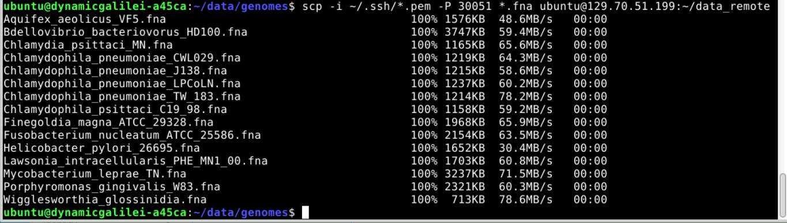
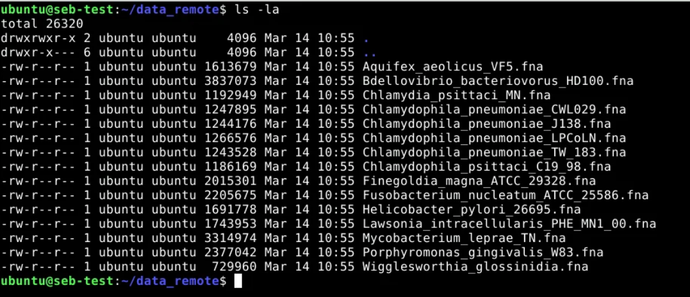
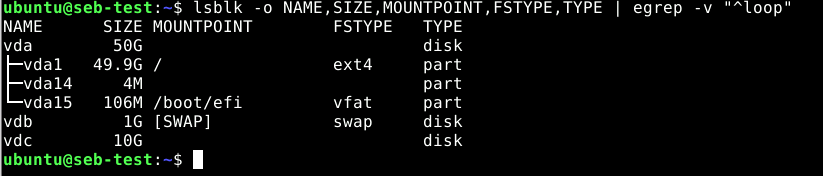

# Section 4: Data Transfer

We have now set up everything to actually transfer some data.
There are different tools for copying files from/to the de.NBI Cloud each for different use cases. Under Linux you can choose between different command line tools. Some of them can also be used with a graphical user interface (GUI) by using a file manager. For Windows users it may be best to use a GUI tool like WinSCP. Some good Linux tools for this use case are:

    1. scp -- secure copy (remote file copy program)
    2. sshfs -- filesystem client based on ssh
    3. rsync -- a fast, versatile, remote (and local) file-copying tool

## 4.1 Simple transfer using scp

In the image of the SimpleVM instances there is already some data located in your HOME directory. We will now copy some of this data to the other cloud instance in the second project.

``` bash
 cd ~/data/genomes
 scp -i ~/.ssh/*.pem -P YOUR_PORT *.fna ubuntu@129.70.51.199:~/data_remote
 ```


 You should now see how the data is copied, after which, you should be able to login again and verify that the data is actually present.

``` bash
 ssh -i ~/.ssh/*.pem -p YOUR_PORT ubuntu@129.70.51.199
 cd data_remote
 ls -la

 ```


## 4.2 Activate a volume

1. Connect to your instance using ssh again
``` bash
      ssh -i ~/.ssh/*.pem  ubuntu@129.70.51.199 -p YOUR_PORT
```

2. In your instance, the volume is attached but not usable yet. List all the devices available on this instance:
``` bash
      lsblk -o NAME,SIZE,MOUNTPOINT,FSTYPE,TYPE | egrep -v "^loop"
```

3. The volume you look for has an empty FSTYPE, an empty MOUNTPOINT and the SIZE should compare to the size of the volume you created and attached. The size can differ a bit because of differences in Bit and Byte. For example, the device you look for could be `vdc`.
  

4. We now need to format this device in order to use it properly. We will use the FS ext4 for this:
``` bash
    sudo mkfs.ext4 /dev/vdc
```

  **Note**: Formatting a device DESTROYS ALL DATA on it! You must format *new* data disks, for example volumes, only once to use them.
  *NEVER* apply this command to an *ALREADY FORMATTED DISK* if you value the data on that disk.
  See if a volume has a file system type by using the lsblk command.

5. We mount this newly formatted block device so we can actually use it. First we create a mountpoint
``` bash
    sudo mkdir -p /vol/volume1
```

6. Then we do the mounting. Please *replace* the `/dev/vdc` with the device your volume was mounted as.
``` bash
    sudo mount /dev/vdc /vol/volume1
```

7. Finally, we need to change the ownership of this mounted volume so we can use it without root privileges.
``` bash
    sudo chown -R ubuntu:ubuntu /vol/volume1
```

8. You can now validate this volume

``` bash
    cd /vol/volume1
    df -h .
```

Back to [Section 3](Part3.md) | Next to [Section 5](Part5.md)
