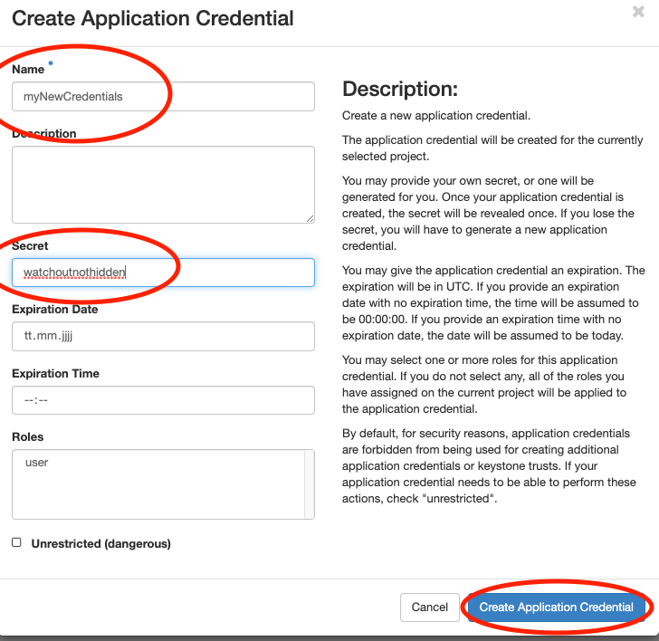

## Section 5: Using the Object Storage

### 5.1 Creating application credentials

In this section you will create an [application
credential](https://access.redhat.com/documentation/zh-cn/red_hat_openstack_platform/14/html/users_and_identity_management_guide/application_credentials)
and download the autogenerated `clouds.yaml`. `clouds.yaml` contains all
required authentication information. Follow the images:


Don't use the input field secret. As you can see its input is not
hidden. OpenStack will generate a strong secret for you, if you leave it
blank. You should pick a sensible expiration date.



Save the downloaded `clouds.yaml` under `~/.config/openstack/`. That
will allow the `OpenstackClient` to access it.


If the file was auto downloaded, you need to move it instead:

``` bash
mkdir -p ~/.config/openstack
mv ~/Downloads/clouds.yaml ~/.config/openstack/
```

If you have `OpenstackClient` installed and `openstack subnet list` runs
without error, you are ready to proceed.

### 5.2 Creating S3 credentials

The creation of credentials for the project related object storage can't
be done in the web interface. Therefore, we will use the openstack CLI
for that.

``` bash
openstack --os-identity-api-version 3 ec2 credentials create
```

This command will return you the newly generated key and secret. You
can, at any time, look up what S3 credentials are still valid for you
using

``` bash
openstack --os-identity-api-version 3 ec2 credentials list
```

We will now configure the S3 minio client:

``` bash
mc config host add spring https://openstack.cebitec.uni-bielefeld.de:8080/ <YOUR-ACCESS-KEY> <YOUR-SECRET-KEY>
```

### 5.3 Uploading data to the Object Storage

We will now use the minio client to upload some data. In the guacamole
SimpleVM instance, type:

``` bash
cd ~/data/fastq
mc ls spring
```

This should show you your previously created bucket (container) name.
You can now upload data into it.

``` bash
mc cp *.fastq spring/YOUR_CONTAINER_NAME
mc ls spring/YOUR_CONTAINER_NAME
```


### 5.4 Interact with the SRA Mirror and search for more datasets to analyse

1.  Add S3 config for our public SRA mirror on our Bielefeld Cloud site:

    ``` bash
    mc config host add sra https://openstack.cebitec.uni-bielefeld.de:8080 "" ""
    ```

2.  List which files are available for SRA number `SRR3984908`:

    ``` bash
    mc ls sra/ftp.era.ebi.ac.uk/vol1/fastq/SRR398/008/SRR3984908
    ```

3.  Check the size of these files

    ``` bash
    mc du sra/ftp.era.ebi.ac.uk/vol1/fastq/SRR398/008/SRR3984908
    ```

4.  You can read the first lines of these files by using `mc cat`.

    ``` bash
    mc cat sra/ftp.era.ebi.ac.uk/vol1/fastq/SRR398/008/SRR3984908/SRR3984908_1.fastq.gz | zcat | head
    ```

5.  These entries are also available directly via URL as they are
    public. For instance, the file above that was inspected using the
    minio client can also be downloaded directly, e.g. using wget.

    ``` bash
    wget https://openstack.cebitec.uni-bielefeld.de:8080/ftp.era.ebi.ac.uk/vol1/fastq/SRR398/008/SRR3984908/SRR3984908_1.fastq.gz
    ```

Back to [Section 4](Part4.md)
