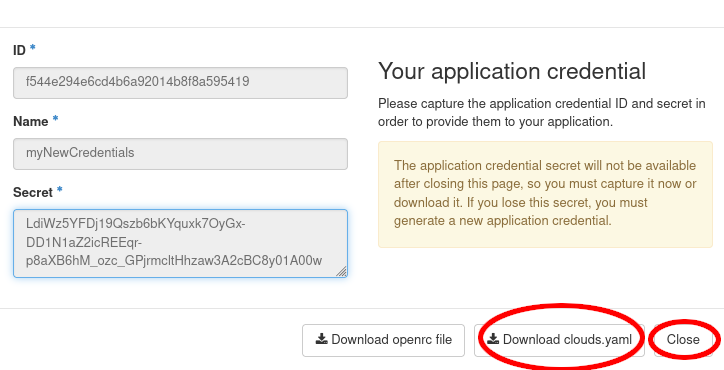
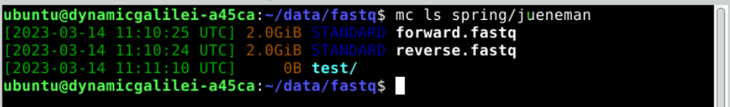

# Section 7: Using the Object Storage

## 7.1 Creating openstack application credentials

In this section you will create an [application
credential](https://access.redhat.com/documentation/zh-cn/red_hat_openstack_platform/14/html/users_and_identity_management_guide/application_credentials)
and download the autogenerated `clouds.yaml`. `clouds.yaml` contains all
required authentication information. Follow the images:


Don't use the input field secret. As you can see its input is not
hidden. OpenStack will generate a strong secret for you, if you leave it
blank. You should pick a sensible expiration date.


Save the downloaded `clouds.yaml` under `~/.config/openstack/`. That
will allow the `OpenstackClient` to access it.



If the file was auto downloaded, you need to move it instead:

``` bash
mkdir -p ~/.config/openstack
mv ~/Downloads/clouds.yaml ~/.config/openstack/
```

If you have `OpenstackClient` installed and `openstack subnet list` runs
without error, you are ready to proceed.

## 7.2 Creating S3 credentials

The creation of credentials for the project related object storage can't
be done in the web interface. Therefore, we will use the openstack CLI
for that.

``` bash
openstack --os-identity-api-version 3 ec2 credentials create
```

This command will return you the newly generated key and secret. You
can, at any time, look up what S3 credentials are still valid for you
using

``` bash
openstack --os-identity-api-version 3 ec2 credentials list
```

We will now configure the S3 minio client:

``` bash
mc config host add ibworkshop https://openstack.cebitec.uni-bielefeld.de:8080/ <YOUR-ACCESS-KEY> <YOUR-SECRET-KEY>
```

## 7.3 Uploading data to the Object Storage

We will now use the minio client to upload some data. In the guacamole
SimpleVM instance, type:

``` bash
cd ~/data/fastq
mc ls ibworkshop
```

This should show you your previously created bucket (container) name.
You can now upload data into it.

``` bash
mc cp *.fastq ibworkshop/YOUR_CONTAINER_NAME
mc ls ibworkshop/YOUR_CONTAINER_NAME
```



## 7.4 Additional Object Storage Operations

For more advanced work with the SRA mirror and metagenomic datasets analysis, please refer to [Section 3.4](Part3.md#34-make-the-analysis-where-the-data-is-located) where we covered working with the de.NBI Cloud SRA mirror in detail.

Here are some additional useful object storage operations:

1. **Copy data between buckets:**
   ``` bash
   mc cp ibworkshop/YOUR_CONTAINER_NAME/file.txt ibworkshop/ANOTHER_CONTAINER/
   ```

2. **Mirror entire directories:**
   ``` bash
   mc mirror ~/local_data ibworkshop/YOUR_CONTAINER_NAME/backup/
   ```

3. **Set public access for sharing data:**
   ``` bash
   mc policy set download ibworkshop/YOUR_CONTAINER_NAME/public/
   ```

4. **Monitor transfer progress:**
   ``` bash
   mc cp --json large_file.gz ibworkshop/YOUR_CONTAINER_NAME/ | jq .
   ```

Back to [Section 6](Part6.md)
